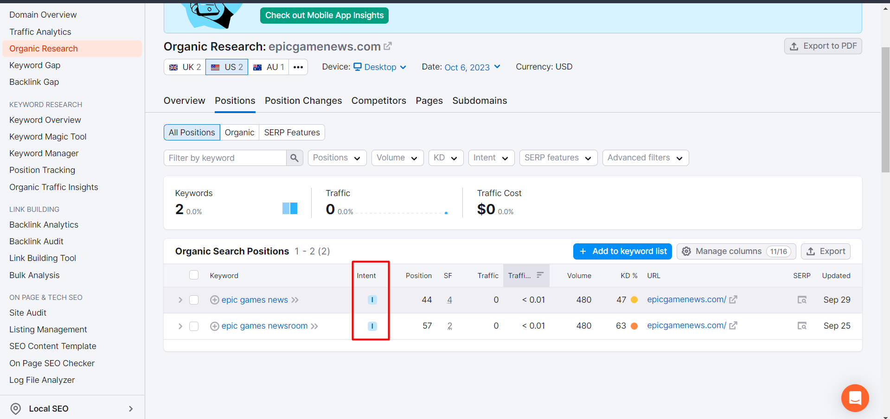
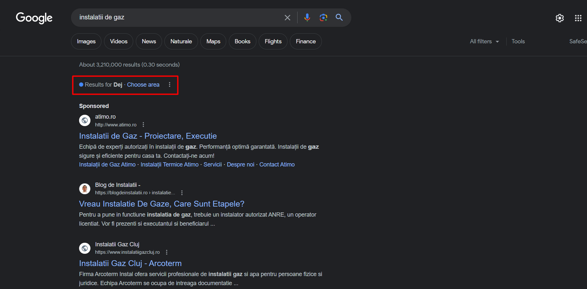
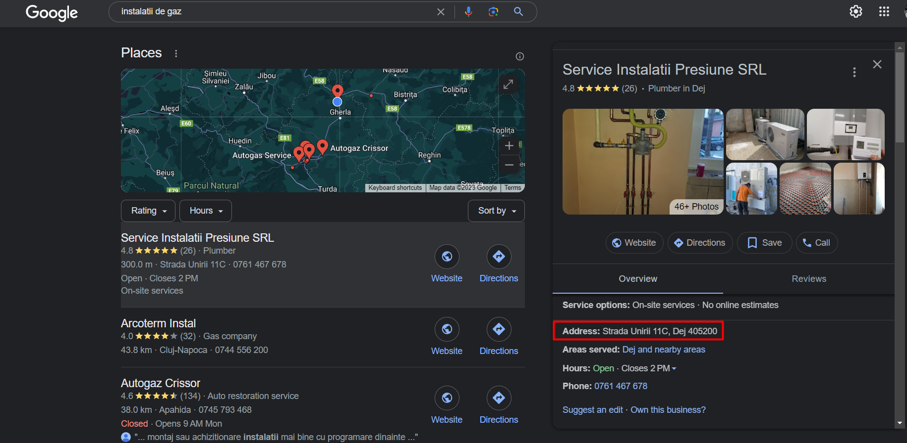

### Sursa: How to Learn SEO Fast (The RIGHT Way): https://www.youtube.com/watch?v=jtLpCLELKgI

# Crawling Indexing Rankings (min 0:23)

- Google trebuie sa fie capabil sa crawl-uiasca (sa târască) website-ul tau, altfel nu il poate indexa. Daca nu il poate indexa, atunci website-ul nu poate ranka. Acesta e cea mai importanta parte din procesul de SEO, pentru ca fara asta, nu mai conteaza nimic altceva ce faci la website.
- Poti descarca extensia gratuita [Detailed SEO Extension](https://chrome.google.com/webstore/detail/detailed-seo-extension/pfjdepjjfjjahkjfpkcgfmfhmnakjfba) ca sa vezi ca paginile tale sunt crawlable si indexabile la prima vedere.
- De asemenea (min 1:08) poti folosi si [Google Search Console](https://search.google.com/search-console/about). Mergi la indexing, pages apoi da scroll down la sectiunea care zice "why pages aren't indexed", iar apoi poti da click pe fiecare problema din lista ca sa vezi investighezi in continuare. De asemenea ai grija, deoarece nu vrei fiecare pagina indexata pe Google precum: login page, checkout pages (pagini de plata), archives pages, pentru ca acestea tind sa creeze content duplicat.

# Keywords (min 1:50)

- Intentia cu care va fi folosit keyword-ul, trebuie sa dicteze strategia continutului tau. Search intent este simplu ce vrea un Searcher (utilizator) sa obtina cand foloseste Google. Prin intelegerea obiectivului final al Searcher-ului poti livra pagina perfecta pentru ei. Iar cand livrezi pagina perfecta pentru ei Google te recompenseaza cu rankings.
- Ca sa intelegi Search intent ai 2 metode:
  - Foloseste Google (min 3:00). Acesta iti va arata tipurile de pagini pe care le crede ca satisfac intentia unui keyword in cele mai multe cazuri, exceptand keyword-urile cu competitie mai mica. Cu o competitie mica, Google nu are de unde sa aleaga, iar asta inseamna ca iti va fi mult mai usor sa rankezi daca creezi un hyper focus page.
  - Poti folosi [Semrush](https://www.semrush.com/) ca sa clasifici keyword-uri bazate pe intentie. Intri pe website, scrii numele websote-ului tau, si mergi la competitive research, apoi click pe Organic research, apoi click pe Positions, apoi uita-te la Intent Column, e precis in 80% din cazuri.
    

# Technical (min 5:15)

- Page loading speed - Core web vitals is a confirmed Google ranking factor, plus viteza de incarcare a site-ului tau este critica pentru conversii. According to Google, a one second website speed Improvement can increase conversions for mobile users by up to 27%.
  - Iar pentru o analiza rapida a vitezei paginii poti folosi:
    - [WebDev](https://web.dev/)
    - [GtMetrix](https://gtmetrix.com/)
  - Pentru o analiza mai detaliata poti folosi:
    - [Google Search Console](https://search.google.com/search-console/about)
    - [Screaming Frog](https://www.screamingfrog.co.uk/seo-spider/) si sa integrezi Google page speed insights API ca sa iti vezi scorurile pe tot website-ul. Iar daca scorul tau e mic, trebuie sa prioritizezi rezolvarea acestor probleme, deoarece e un factor cu control direct.

# Site Architecture (min 6:20)

- Explicat simplu, arhitectura website-ului e bazata pe internal linking strategy. Iar aici sunt 3 elemente principale pentru optimizarea arhitercturii:
  - Crawl depth: Poti folosi [Screaming Frog](https://www.screamingfrog.co.uk/seo-spider/) si sa vezi coloana Crawl Depth. Ar trebui sa nu ai mai mult de 3 click-uri adancime. Cu cat paginile tale sunt accesate mai adanc in arhitectura, cu atat asta indica o prioritate mai mica, iar Google va urmari si crawl-ui aceste pagini mai putin, iar unele ar putea sa nu fie indexate daca sunt prea adanci in arhitectura.
  - Internal Linking Coverage - Cantitatea link-urilor interne este importanta pentru o pagina. Prin urmare trebuie sa ai mai multe link interne daca vrei o performanta mai buna in SEO. Tot la [Screaming Frog](https://www.screamingfrog.co.uk/seo-spider/), uita-te la coloana Unique Inlinks ca sa vezi ce pagini au nevoie de mai multe internal links.
  - Internal Link Anchor Text - Using descriptive anchor text is best for internal links. Asta inseamna ca e bine sa iti optimizezi internal link anchors. De exemplu, NU folosi generic anchor text precum "acest articol", in schimb foloseste ceva exact, concret sau macar partial, de exemplu daca vreau sa link-uiesc la articolul meu despre "Diablo III", voi folosi "Diablo 3" ca anchor text. Regula asta nu se aplica la construirea link-urilor. Trebuie sa fii mult mai atent cand vine vorba de external anchor text

# Content (min 7:47)

- Sunt 2 tipuri de SEO Content
  - Keyword-Focused Content si Non Keyword-Focused Content:
    - Keyword-Focused Content - Asta e orice pagina care este construita in jurul unei fraze keyword dedicata (dedicate keyword phrase). Recomandarea este ca 80% din continutul de pe site sa fie in aceasta categorie pentru a primi mai mult trafic organic de la Google.
    - Non Keyword-Focused Content - Satisfy the Intent, but be the Purple Cow (Seth Godin), adica vrei sa fii in top 10 pe Google.
  - Build a MOAT - Continutul tau ar trebuie sa fie atat de unic, incat sa fie foarte dificil pentru competitorii tai sa te copieze. Ca sa faci asta, ai nevoie de unique data si exceptional design. Cu cat investesti mai mult in continut din perspectiva timpului si a capitalului, cu atat va fii mai greu de copiat.

# On Page SEO (min 9:33)

- Trebuie sa iti pui "keyword phrase-ul" exact in:
  - URL (adica linku de sus de la website-ul tau, din browser search bar)
  - Title (banuiesc ca titlul de la website)
  - Meta description
  - `<h1></h1>`
  - First Sentance
  - Last Sentance
- De asemenea ar trebui sa iei in considerare si adaugarea unei variatii a keyword-ului tau principal in primul `<h2></h2>` tag
- Optimizarile astea simple ar trebui sa te puna in fata a 80% din competitie, dar daca vrei sa treci deja la urmatorul nivel, trebuie sa optimizezi NLP (Natural Language Processing)
  - Poti folosi **[Surfer](https://surferseo.com/)** tool ca sa verifici asta

# Local SEO (min 10:17)

- Unele variabile sunt specifice pentru "Google's local pack". Ce este? Este prima sectiune care apare deasupra rezultatelor traditionale organice (vezi imaginea). Adica in principiu vrei sa optimizezi SEO pentru o locatie anume, de exemplu pentru Dej sau oricare alt oras.
  
  - Trebuie sa ai o adresa in 
  - Securizeaza-ti profilul de Google si completeaza cu informatii relevante, incluzand keyword-ul tau in business description. De exemplu: Instalații de gaz în Dej
  - Incearca sa primesti cat mai multe review-uri, deoarece acestea sunt cheia pentru pentru "local pack ranking"
  - Asigura-te ca informatia NAP(Name, Adress, Phone) este consistenta. Poti folosi [Brightlocal Tool](https://www.brightlocal.com/local-seo-tools/auditing/citation-tracker/) pentru asta

# Link building backlinks

- Link building backlinks sunt link-uri din alte website-uri spre website-ul tau. Google foloseste backlinks ca si voturi pentru website-ul tau. Cu cat ai mai multe backlink-uri din website-uri relevante si mari, vei performa mai bine pe Google. Ca sa faci asta cea mai simpla solutie e sa creezi lucruri de calitate pe care lumea le vrea, astfel o sa te includa si pe website-urile lor. Poti face si tu asta pentru inceput distribuind website-ul pe social media, de exemplu pe pagina ta de facebook poti share-ui website-ul.
- Poti folosi [Link Ahrefs Intersect Tool](https://ahrefs.com/link-intersect) ca sa vezi backlink-urile pe care le au competitorii tai, ca sa stii unde pe ce website-uri trebuie sa apari si tu.
