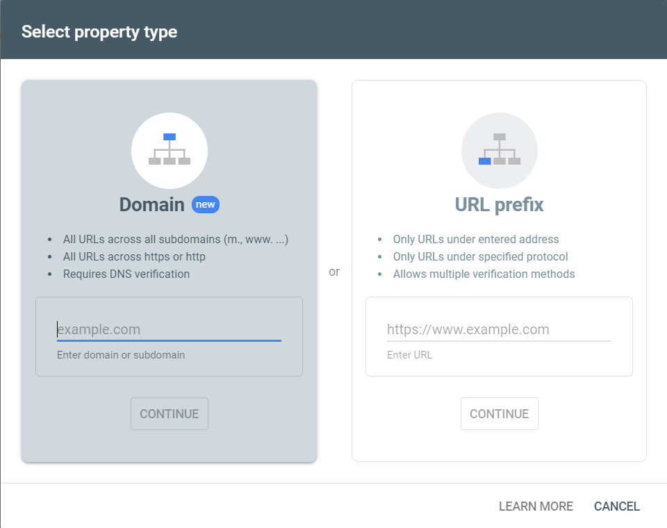
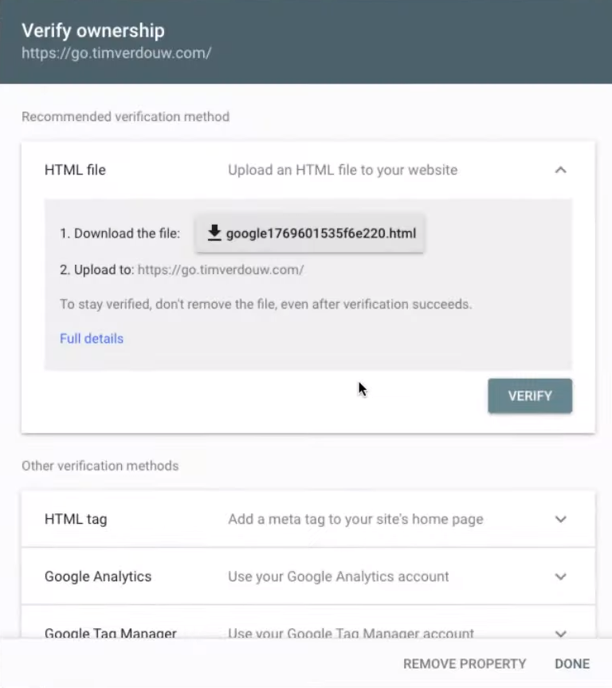
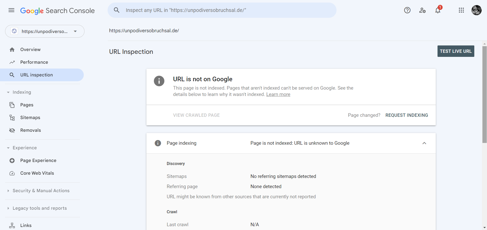
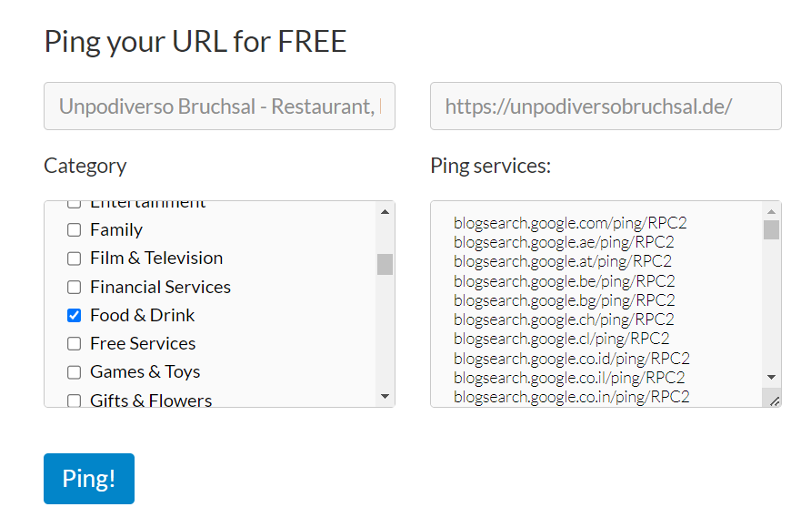
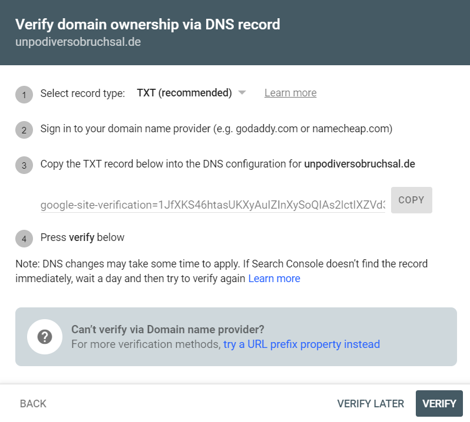
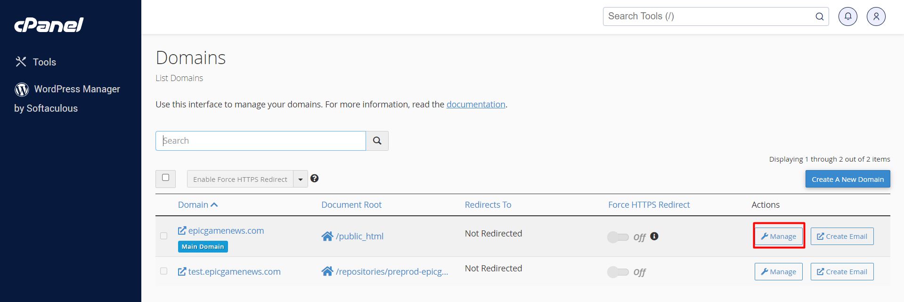
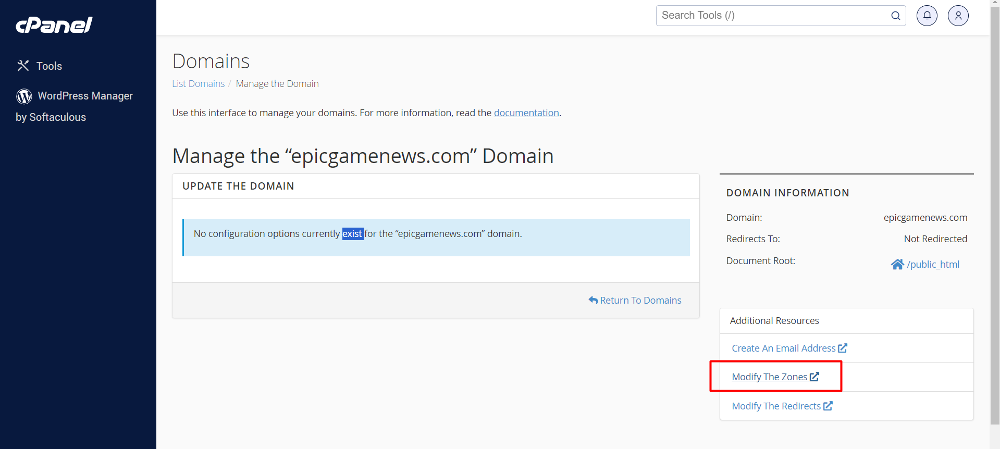
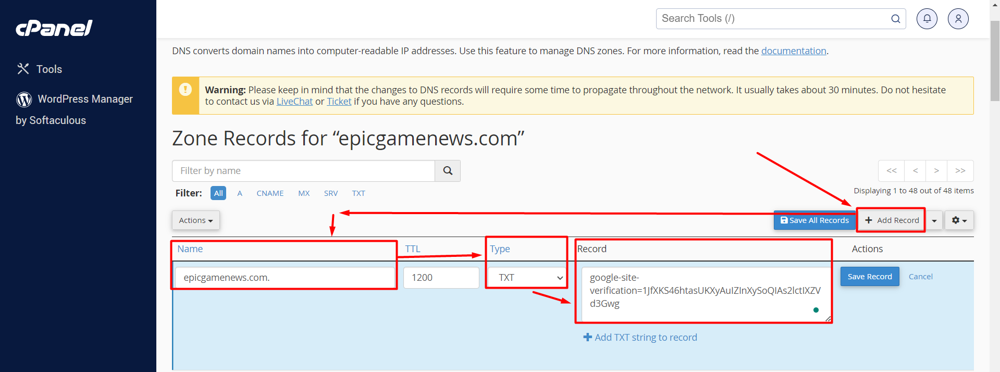

# Index your website faster
1. Intra pe [Google Search Console](https://search.google.com/search-console/about) si dai pe start.

2. Dai pe Add property dupa care ti se deschide un tab nou cu Domain si cu URL prefix

3. Detalii de la chat GPT despre Domain si URL prefix:
    - In Google Search Console, "Domain" and "URL Prefix" are two different methods of property verification and management. Here's a brief explanation of the differences:

- Domain Property:
    - Definition: 
        - A domain property represents an entire domain, including all its subdomains. It is a higher-level property that covers all URLs associated with that domain.
    - Advantages:
        - Easier management: With a domain property, you don't need to separately verify and manage each subdomain. Changes and insights apply to the entire domain.
        - Comprehensive data: It provides a holistic view of the domain's performance in search results.

- URL Prefix Property:
    - Definition: 
        - A URL prefix property is more specific and focuses on a particular protocol (http or https), subdomain, and path. It is a property created for a specific section of a website, rather than the entire domain.
    - Advantages:
        - Granular control: URL prefix properties allow you to focus on and analyze specific sections of your website, useful for larger websites with distinct subdirectories.
        - Separate tracking: If you have different sections of your site that require separate attention, URL prefix properties enable you to manage them independently.      
      
- In summary, the main difference lies in the scope of the property. A domain property covers the entire domain and its subdomains, while a URL prefix property is more specific, targeting a particular protocol, subdomain, and path. The choice between them depends on the structure and management needs of your website.

4. Implementare URL prefix. Scrii site-ul cu tot cu protocol, ex: https://www.exemplu.com/
- Link: https://www.youtube.com/watch?v=Kimd_x8A5x4
- Apoi dai pe continue si se deschide un tab nou Verify Ownership

- Dai pe sageata de la HTML tag si poti poti copia meta tag-ul si sa il adaugi in <head> la proiectul tau. Asta e o varianta simpla si rapida. Dupa ce ai pus meta tag-ul in <head> te intorci inapoi, aici la Verify Owenership si dai click pe Verify. Daca nu merge mai da un refresh. Acum ar trebui sa fie verificat.
- Ca sa testezi poti merge pe google si scrii: site:https://www.exemplu.com/
- Daca site-ul nu apare inseamna ca nu s-a indexat inca.
- Mai poti verifica in Google Search Console la URL inspection, dupa care scrii sus numele site-ului cu tot cu protocol: https://www.exemplu.com/
- Apoi dai click pe REQUEST INDEXING. Daca abia ai facut lucrurile astea, o sa dureze o vreme, poate o zi pana se indexeaza site-ul:

- Apoi poti intra pe [Pingler](https://pingler.com/) si sa adaugi https://www.exemplu.com/ si sa alegi setarile bune pentru site-ul tau, dupa care dai click pe Ping.

5. Implementare Domain. Scrii numele site-ululu, ex: exemplu.com
Link: https://www.youtube.com/watch?v=bX6sxea5Rok&list=PLGVB5QfLvwz_aPt1EM7oeYwOXqxEFwZhl&index=7
- Dupa aceea se va deschide un tab nou Verify domain ownership via DNS record si copiezi codul TXT

- Apoi mergi in cPanel la Domains, la domeniul dorit si dai pe Manage

- Intri la Modify the zones

- Dai pe Add record, scrii numele domeniului la Name, la TYPE selectezi TXT, iar la Record pui textul ce l-ai copiat prima data din "Google Search Console - Verify domain ownership via DNS record" apoi dai pe Add Record.

- Apoi te intorci la Google Search Console si dai pe Verify si gata.